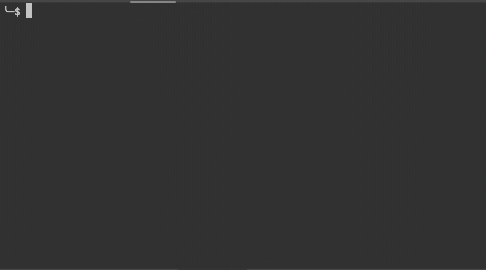
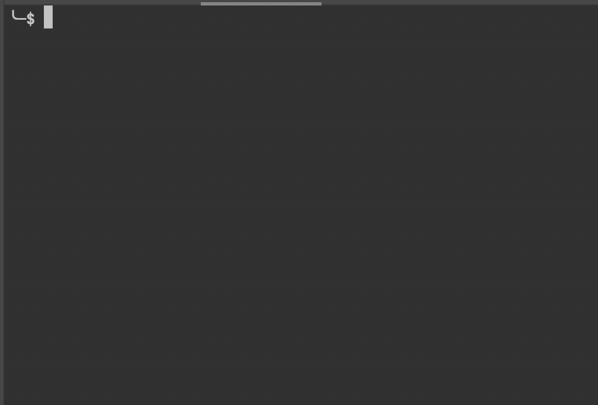

# Zing

*The bookmark manager of your bash scripts.*

## Intro  

Zing is a cli application that allows you to store all your bash scripts in an easy to main yaml file.

Scripts can be saved using a key word and a description to make it easy to remember.

**Demo**




## How to Build

The application needs the conf.yaml file next to the executable file.
Make sure you have GO installed  the dependencies from go.mod installed.   
To build the app make sure you terminal path is `zing/src/`

In your bash execute `$ go build zing.go` this will create a binary file `zing` 

You can now run the file using `$ ./zing`

Example `./zing demo`

## How to Run

App requires a conf.yaml to run against. Take a look at folder `Build-Demo` to see the format of the app.
Zing can be passed arguments to run the scripts you defined in conf.yaml

To see all available command simply run after build `./zing`


For example a conf.yaml that has key `demo`
Can be called by running `$ ./zing demo`
```yaml

- run:
    key: 'demo'
    description: "I am all about that bash that bash: "
    path: "~/Documents/go/src/github.com/bogdan-largeanu/src/src"
    literal_block_bash_file: |
      echo hello chewbacca
      ls
      pwd
```


Alternative method if the app is not build is to run `$ go run zing.go demo` in src folder.


## Folder Structure

!! Warning Windows and linux build not tested. I recommend you Build from scratch.

The zing app expected to be next to a conf.yaml file.

## Next Steps

At the moment path is still in progress. 
The project is very early stages, so the code is def buggy. Please raise a github issue if you noticed bugs.